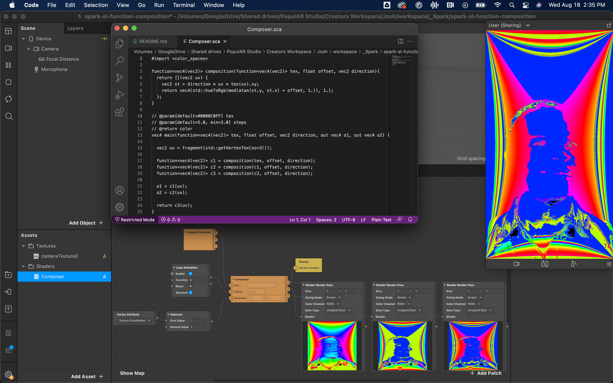

## Function Composition in Spark SL

This is an example project that shows how to use function/composition in SparkSL. The benefit of this is that you can chain operations that require sampling after each step, and it maintains the sample-ability in the patch editor (unlike texture sampler, which outputs a color).
